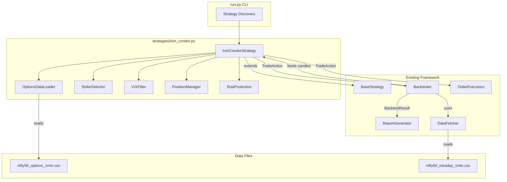
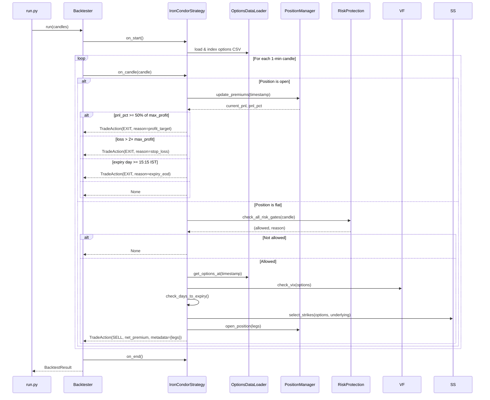
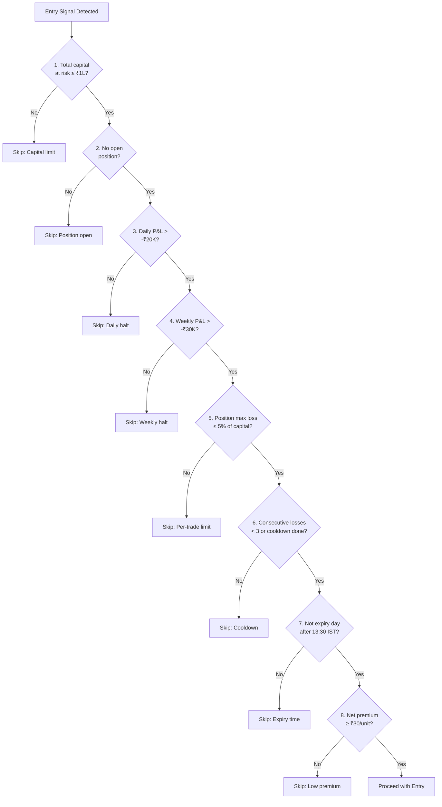

# Design Document: Nifty 50 Iron Condor Strategy

## Overview

This design describes a Nifty 50 Iron Condor options strategy plugin (`IronCondorStrategy`) for the existing Python trading framework. The strategy sells a weekly OTM call spread and OTM put spread simultaneously (4 legs), profiting when Nifty 50 stays within a range. It uses delta-based strike selection (15–16 delta), a VIX proxy filter for entry, and manages positions with a 50% profit target, 2× stop-loss, and expiry-day forced exit. Eight layered risk protections guard capital.

The strategy extends `BaseStrategy`, integrates with the existing `Backtester`, all three order executors (Paper/Sandbox/Live), the CLI (`run.py`), and produces `BacktestResult` objects compatible with `ReportGenerator`.

### Key Design Decisions

1. **Options data loaded in-memory at startup** — The `nifty50_options_1min.csv` is loaded once in `on_start()` and indexed into a nested dict for O(1) lookup by (timestamp_minute, expiry, strike, option_type). This avoids repeated file I/O during the candle loop. The CSV is ~500MB+ so we use a streaming parser that only retains the fields needed (strike, expiry, option_type, close/LTP, delta, IV, underlying_close, days_to_expiry, instrument_key).

2. **Strategy owns all state** — Position tracking, risk state (daily/weekly P&L, consecutive losses, cooldown), and the options index all live inside `IronCondorStrategy`. The existing `Backtester` sees standard `TradeAction(Signal.SELL)` for entry and `TradeAction(Signal.EXIT)` for exit, with all multi-leg details encoded in `metadata`. This means zero changes to `Backtester`, `OrderExecutorBase`, or `ReportGenerator`.

3. **Composite position as a single Trade** — The 4-leg Iron Condor is represented as one `Trade` in the backtester. Entry price = net premium collected. Exit price = net premium at close. P&L = (entry_net_premium − exit_net_premium) × lot_size. The `metadata` dict carries full leg details for order executors to place 4 simultaneous orders in live mode.

4. **Risk checks as an ordered pipeline** — The 8 risk protections are evaluated in a fixed order (capital cap → single position → daily halt → weekly halt → per-trade max loss → consecutive loss cooldown → expiry-day time restriction → minimum premium). Each check returns a (pass/fail, reason) tuple. The first failure short-circuits entry.

## Architecture



### Data Flow (Backtest Mode)




## Components and Interfaces

### 1. IronCondorStrategy (main class)

Extends `BaseStrategy`. Single file: `strategies/iron_condor.py`.

```python
class IronCondorStrategy(BaseStrategy):
    """Nifty 50 Iron Condor (weekly expiry)."""

    name = "iron_condor"
    description = "Nifty 50 Iron Condor (weekly expiry)"
    default_instrument = "NSE_INDEX|Nifty 50"
    default_lot_size = 25
    default_candle_interval = "1min"
    requires_option_data = True
    brokerage_per_trade = 500.0

    def __init__(
        self,
        *,
        max_vix: float = 13.0,
        short_strike_delta_min: float = 0.15,
        short_strike_delta_max: float = 0.16,
        spread_width: int = 50,
        profit_target_pct: float = 50.0,
        stop_loss_multiplier: float = 2.0,
        entry_days_before_expiry_min: int = 5,
        entry_days_before_expiry_max: int = 10,
        max_total_capital: float = 100_000.0,
        max_daily_loss: float = 20_000.0,
        max_weekly_loss: float = 30_000.0,
        max_loss_pct_of_capital: float = 5.0,
        max_consecutive_losses: int = 3,
        min_premium_per_unit: float = 30.0,
        max_capital_per_position: float = 12_000.0,
    ) -> None: ...

    def on_start(self) -> None: ...
    def on_candle(self, candle: Candle) -> Optional[TradeAction]: ...
    def on_end(self) -> None: ...
    def get_position(self) -> str: ...
```

**Constructor validation rules** (raises `ValueError`):
- `spread_width` must be a positive integer
- `profit_target_pct` must be in [1, 100]
- `stop_loss_multiplier` must be > 0
- `short_strike_delta_min` < `short_strike_delta_max`
- `max_total_capital` > 0
- `max_daily_loss` > 0
- `max_loss_pct_of_capital` in [1, 100]

### 2. OptionsDataLoader

Internal helper class within `iron_condor.py`. Loads and indexes the options CSV.

```python
class OptionsDataLoader:
    """Load nifty50_options_1min.csv and index by (timestamp_minute, expiry, strike, option_type)."""

    def __init__(self, csv_path: str) -> None: ...

    def load(self) -> bool:
        """Load and index the CSV. Returns True on success, False on failure."""
        ...

    def get_options_at(self, timestamp: datetime, tolerance_seconds: int = 60) -> list[OptionRecord]:
        """Return all option records available at the given timestamp (±tolerance)."""
        ...

    def get_option(
        self, timestamp: datetime, expiry: date, strike: float, option_type: str
    ) -> Optional[OptionRecord]:
        """Look up a specific contract at a specific time."""
        ...

    def get_nearest_expiry(self, timestamp: datetime) -> Optional[date]:
        """Return the nearest weekly expiry date from the available data at this timestamp."""
        ...
```

**Indexing strategy**: The CSV is parsed row-by-row. Each row is stored as a lightweight `OptionRecord` namedtuple. The primary index is a `dict[str, list[OptionRecord]]` keyed by `timestamp_minute` (truncated to `YYYY-MM-DDTHH:MM`). A secondary index `dict[tuple[str, str, float, str], OptionRecord]` maps `(timestamp_minute, expiry_str, strike, option_type)` for direct leg lookups during position monitoring.

```python
class OptionRecord(NamedTuple):
    timestamp_minute: str       # "2024-08-28T09:15"
    close: float                # option LTP
    strike_price: float
    expiry: str                 # "2024-09-05"
    option_type: str            # "CE" or "PE"
    underlying_close: float
    days_to_expiry: float
    iv: float
    delta: float
    instrument_key: str
```

### 3. VIXFilter

Internal helper. Derives a VIX proxy from ATM implied volatility.

```python
class VIXFilter:
    """Evaluate whether VIX conditions permit entry."""

    def __init__(self, max_vix: float) -> None: ...

    def is_entry_allowed(self, options: list[OptionRecord], underlying_close: float) -> bool:
        """Return True if the ATM IV proxy is at or below max_vix.
        
        ATM is defined as the strike nearest to underlying_close.
        VIX proxy = average IV of ATM CE and ATM PE.
        """
        ...
```

### 4. StrikeSelector

Internal helper. Selects the 4 strikes based on delta.

```python
@dataclass
class SelectedLegs:
    short_call_strike: float
    short_call_premium: float
    short_call_delta: float
    short_call_instrument_key: str
    long_call_strike: float
    long_call_premium: float
    long_call_delta: float
    long_call_instrument_key: str
    short_put_strike: float
    short_put_premium: float
    short_put_delta: float
    short_put_instrument_key: str
    long_put_strike: float
    long_put_premium: float
    long_put_delta: float
    long_put_instrument_key: str
    expiry: str
    underlying_price: float

class StrikeSelector:
    """Select 4 Iron Condor strikes based on delta values."""

    def __init__(
        self,
        delta_min: float,
        delta_max: float,
        spread_width: int,
    ) -> None: ...

    def select(
        self,
        options: list[OptionRecord],
        underlying_close: float,
        expiry: str,
    ) -> Optional[SelectedLegs]:
        """Select the 4 legs. Returns None if valid strikes can't be found.
        
        Algorithm:
        1. Filter OTM calls (strike > underlying) with the target expiry
        2. Find the CE whose |delta| is closest to midpoint of [delta_min, delta_max]
        3. Short call = that CE; Long call = short_call_strike + spread_width
        4. Filter OTM puts (strike < underlying) with the target expiry
        5. Find the PE whose |delta| is closest to midpoint of [delta_min, delta_max]
        6. Short put = that PE; Long put = short_put_strike - spread_width
        7. Verify all 4 contracts exist in the options data
        """
        ...
```

### 5. PositionManager

Internal helper. Tracks the open 4-leg position and computes combined P&L.

```python
@dataclass
class IronCondorPosition:
    """Represents an open Iron Condor position."""
    legs: SelectedLegs
    entry_net_premium: float        # (short_call + short_put) - (long_call + long_put)
    max_profit: float               # = entry_net_premium
    max_loss: float                 # = spread_width - max_profit
    entry_timestamp: datetime
    lot_size: int
    # Last known premiums for each leg (updated each candle)
    current_short_call_premium: float
    current_long_call_premium: float
    current_short_put_premium: float
    current_long_put_premium: float

class PositionManager:
    """Track the 4-leg Iron Condor as a single composite position."""

    def __init__(self, lot_size: int) -> None: ...

    @property
    def is_open(self) -> bool: ...

    @property
    def position(self) -> Optional[IronCondorPosition]: ...

    def open_position(self, legs: SelectedLegs, timestamp: datetime, lot_size: int) -> IronCondorPosition:
        """Record a new Iron Condor entry."""
        ...

    def update_premiums(
        self,
        timestamp: datetime,
        data_loader: OptionsDataLoader,
    ) -> None:
        """Update current premiums for all 4 legs from latest data.
        Falls back to last known premium if data unavailable for a leg.
        """
        ...

    def get_current_pnl(self) -> float:
        """Combined P&L in rupees: (entry_net_premium - current_net_premium) × lot_size."""
        ...

    def get_pnl_pct_of_max_profit(self) -> float:
        """Current P&L as percentage of max_profit."""
        ...

    def close_position(self) -> dict:
        """Close the position and return exit metadata dict."""
        ...
```

### 6. RiskProtection

Internal helper. Ordered pipeline of 8 risk checks.

```python
@dataclass
class RiskState:
    """Mutable risk tracking state."""
    daily_realized_pnl: float = 0.0
    weekly_realized_pnl: float = 0.0
    consecutive_losses: int = 0
    is_daily_halted: bool = False
    is_weekly_halted: bool = False
    is_cooldown: bool = False
    cooldown_skipped: bool = False      # True after skipping one entry in cooldown
    current_day: Optional[date] = None
    current_week_start: Optional[date] = None  # Monday of current week

class RiskProtection:
    """Ordered pipeline of 8 risk protection checks."""

    def __init__(
        self,
        max_total_capital: float,
        max_daily_loss: float,
        max_weekly_loss: float,
        max_loss_pct_of_capital: float,
        max_consecutive_losses: int,
        min_premium_per_unit: float,
        max_capital_per_position: float,
        lot_size: int,
    ) -> None: ...

    def check_entry_allowed(
        self,
        proposed_max_loss: float,
        net_premium_per_unit: float,
        is_expiry_day: bool,
        current_time_ist: time,
        position_is_open: bool,
    ) -> tuple[bool, str]:
        """Run all 8 risk checks in order. Returns (allowed, reason).
        
        Check order:
        1. Max total capital at risk
        2. Single position at a time
        3. Daily loss limit (halt state)
        4. Weekly loss limit (halt state)
        5. Per-trade max loss (% of capital)
        6. Consecutive loss cooldown
        7. No entry in last 2 hours of expiry day (after 13:30 IST)
        8. Minimum premium filter
        """
        ...

    def on_new_day(self, current_date: date) -> None:
        """Reset daily state. Called when a new trading day is detected."""
        ...

    def on_new_week(self, current_date: date) -> None:
        """Reset weekly state. Called when Monday is detected."""
        ...

    def record_trade_result(self, pnl_rupees: float) -> None:
        """Update daily/weekly P&L and consecutive loss tracking after a trade closes."""
        ...

    def should_force_close(self) -> bool:
        """Return True if daily or weekly halt was just triggered and a position is open."""
        ...
```


## Data Models

### OptionRecord (lightweight namedtuple for in-memory index)

```python
class OptionRecord(NamedTuple):
    timestamp_minute: str       # "2024-08-28T09:15" (truncated for indexing)
    close: float                # Option LTP (close price from CSV)
    strike_price: float         # e.g., 24500.0
    expiry: str                 # "2024-09-05" (date string)
    option_type: str            # "CE" or "PE"
    underlying_close: float     # Nifty 50 spot at this timestamp
    days_to_expiry: float       # e.g., 7.5
    iv: float                   # Implied volatility (annualized, e.g., 0.12)
    delta: float                # Option delta (e.g., 0.15 for CE, -0.15 for PE)
    instrument_key: str         # e.g., "NSE_FO|NIFTY24SEP24500CE"
```

### SelectedLegs (dataclass for the 4 chosen strikes)

```python
@dataclass
class SelectedLegs:
    short_call_strike: float
    short_call_premium: float
    short_call_delta: float
    short_call_instrument_key: str
    long_call_strike: float
    long_call_premium: float
    long_call_delta: float
    long_call_instrument_key: str
    short_put_strike: float
    short_put_premium: float
    short_put_delta: float
    short_put_instrument_key: str
    long_put_strike: float
    long_put_premium: float
    long_put_delta: float
    long_put_instrument_key: str
    expiry: str                 # "2024-09-05"
    underlying_price: float     # Nifty 50 spot at entry
```

### IronCondorPosition (dataclass for open position state)

```python
@dataclass
class IronCondorPosition:
    legs: SelectedLegs
    entry_net_premium: float        # Per unit: (short_call + short_put) - (long_call + long_put)
    max_profit: float               # = entry_net_premium (per unit)
    max_loss: float                 # = spread_width - max_profit (per unit)
    entry_timestamp: datetime
    lot_size: int
    spread_width: int
    # Current premiums (updated each candle)
    current_short_call_premium: float
    current_long_call_premium: float
    current_short_put_premium: float
    current_long_put_premium: float
```

### RiskState (dataclass for mutable risk tracking)

```python
@dataclass
class RiskState:
    daily_realized_pnl: float = 0.0
    weekly_realized_pnl: float = 0.0
    consecutive_losses: int = 0
    is_daily_halted: bool = False
    is_weekly_halted: bool = False
    is_cooldown: bool = False
    cooldown_skipped: bool = False
    current_day: Optional[date] = None
    current_week_start: Optional[date] = None
```

### TradeAction Metadata Schemas

**Entry metadata** (Signal.SELL):
```python
{
    "legs": [
        {"strike": 24500, "option_type": "CE", "action": "sell", "premium": 85.5, "delta": 0.155, "instrument_key": "..."},
        {"strike": 24550, "option_type": "CE", "action": "buy",  "premium": 62.3, "delta": 0.12,  "instrument_key": "..."},
        {"strike": 24200, "option_type": "PE", "action": "sell", "premium": 78.2, "delta": -0.155, "instrument_key": "..."},
        {"strike": 24150, "option_type": "PE", "action": "buy",  "premium": 55.1, "delta": -0.12,  "instrument_key": "..."},
    ],
    "expiry": "2024-09-05",
    "max_profit": 46.3,         # per unit
    "max_loss": 3.7,            # per unit (spread_width - max_profit)
    "spread_width": 50,
    "underlying_price": 24350.0,
}
```

**Exit metadata** (Signal.EXIT):
```python
{
    "reason": "profit_target",  # or "stop_loss", "expiry_eod", "daily_loss_limit", "weekly_loss_limit"
    "pnl_pct": 52.3,           # % of max_profit achieved
    "pnl_rupees": 578.5,       # total P&L in rupees
    "days_held": 3.5,
    "legs": [
        {"strike": 24500, "option_type": "CE", "action": "buy",  "premium": 42.1, "instrument_key": "..."},
        {"strike": 24550, "option_type": "CE", "action": "sell", "premium": 30.5, "instrument_key": "..."},
        {"strike": 24200, "option_type": "PE", "action": "buy",  "premium": 38.0, "instrument_key": "..."},
        {"strike": 24150, "option_type": "PE", "action": "sell", "premium": 26.8, "instrument_key": "..."},
    ],
}
```

### P&L Computation

The Iron Condor P&L is computed as follows:

```
entry_net_premium = (short_call_entry + short_put_entry) - (long_call_entry + long_put_entry)
current_net_premium = (short_call_current + short_put_current) - (long_call_current + long_put_current)

pnl_per_unit = entry_net_premium - current_net_premium
pnl_rupees = pnl_per_unit × lot_size

pnl_pct_of_max_profit = (pnl_per_unit / max_profit) × 100
```

When the Iron Condor decays favorably (premiums shrink), `current_net_premium` decreases, making `pnl_per_unit` positive. At 50% profit target, `pnl_per_unit ≥ 0.5 × max_profit`.

### Options Data Index Structure

```
Primary index (for getting all options at a timestamp):
    _by_timestamp: dict[str, list[OptionRecord]]
    Key: "2024-08-28T09:15" → [OptionRecord, OptionRecord, ...]

Secondary index (for looking up specific contracts):
    _by_contract: dict[tuple[str, str, float, str], OptionRecord]
    Key: ("2024-08-28T09:15", "2024-09-05", 24500.0, "CE") → OptionRecord

Expiry index (for finding nearest expiry at a timestamp):
    _expiries_by_timestamp: dict[str, set[str]]
    Key: "2024-08-28T09:15" → {"2024-09-05", "2024-09-12", ...}
```

### Backtester Integration

The existing `Backtester` handles Iron Condor trades without modification:

1. `on_candle()` returns `TradeAction(Signal.SELL, price=net_premium, ...)` → Backtester calls `_open_trade()` with direction="short"
2. `on_candle()` returns `TradeAction(Signal.EXIT, price=current_net_premium, ...)` → Backtester calls `_close_trade()`
3. P&L computed by Backtester: `entry_price - exit_price` (since direction="short") = `entry_net_premium - current_net_premium` = correct Iron Condor P&L per unit
4. `pnl_rupees = pnl_points × quantity` where quantity = lot_size (25)

The `BacktestResult` produced is fully compatible with `ReportGenerator`. Iron Condor-specific metrics (avg premium collected, % exits by reason, avg days held) are computed post-hoc from `Trade.metadata` in a helper function.

### Risk Protection Check Order (State Machine)




## Correctness Properties

*A property is a characteristic or behavior that should hold true across all valid executions of a system — essentially, a formal statement about what the system should do. Properties serve as the bridge between human-readable specifications and machine-verifiable correctness guarantees.*

### Property 1: Options data parsing round-trip

*For any* valid CSV row containing option data fields (timestamp, close, strike_price, expiry, option_type, underlying_close, days_to_expiry, iv, delta, instrument_key), parsing the row into an `OptionRecord` and then querying the index by (timestamp_minute, expiry, strike_price, option_type) should return a record whose fields match the original CSV values.

**Validates: Requirements 2.1, 2.2**

### Property 2: Timestamp tolerance lookup

*For any* timestamp T that is within 60 seconds of a timestamp T' present in the options index, calling `get_options_at(T)` should return a non-empty list that includes the records indexed at T'.

**Validates: Requirements 2.4**

### Property 3: VIX filter entry gate

*For any* set of option records at a given timestamp and underlying close price, the VIX filter should allow entry if and only if the average implied volatility of the ATM options (CE and PE at the strike nearest to underlying_close) is less than or equal to `max_vix`.

**Validates: Requirements 3.2, 3.3, 3.4**

### Property 4: Delta-based short strike selection

*For any* set of OTM option records for a given expiry and underlying price, the `StrikeSelector` should choose the short call (CE) and short put (PE) whose absolute delta values are closest to the midpoint of `[short_strike_delta_min, short_strike_delta_max]` among all available OTM options of that type.

**Validates: Requirements 4.2, 4.3**

### Property 5: Long strike offset by spread width

*For any* selected Iron Condor legs, the long call strike should equal the short call strike plus `spread_width`, and the long put strike should equal the short put strike minus `spread_width`.

**Validates: Requirements 4.5, 4.6**

### Property 6: P&L computation correctness

*For any* four entry premiums (short_call, long_call, short_put, long_put) and four current premiums, the following must hold:
- `max_profit` = (short_call_entry + short_put_entry) − (long_call_entry + long_put_entry)
- `max_loss` = spread_width − max_profit
- `pnl_per_unit` = entry_net_premium − current_net_premium
- `pnl_rupees` = pnl_per_unit × lot_size
- `pnl_pct` = (pnl_per_unit / max_profit) × 100

**Validates: Requirements 5.4, 5.5, 6.3, 6.4**

### Property 7: Entry TradeAction completeness

*For any* valid Iron Condor entry, the returned `TradeAction` must have `signal=Signal.SELL`, `price` equal to the net premium collected, `quantity` equal to `default_lot_size`, and `metadata` containing: `legs` (list of 4 dicts each with strike, option_type, action, premium, delta, instrument_key), `expiry`, `max_profit`, `max_loss`, `spread_width`, and `underlying_price`.

**Validates: Requirements 5.3, 5.8, 11.1, 11.3**

### Property 8: Exit TradeAction completeness

*For any* Iron Condor exit, the returned `TradeAction` must have `signal=Signal.EXIT`, `quantity` equal to `default_lot_size`, and `metadata` containing: `reason`, `pnl_pct`, `pnl_rupees`, `days_held`, and `legs` (with current premiums for each leg).

**Validates: Requirements 11.2, 11.3**

### Property 9: Days-to-expiry entry window

*For any* candle timestamp where `days_to_expiry` for the nearest weekly expiry falls within `[entry_days_before_expiry_min, entry_days_before_expiry_max]`, entry evaluation should proceed (assuming other conditions are met). For timestamps where `days_to_expiry` is outside this range, entry should be skipped.

**Validates: Requirements 5.2**

### Property 10: Capital per position gate

*For any* proposed Iron Condor position where `max_loss × lot_size` exceeds `max_capital_per_position`, the strategy should skip entry and return `None`.

**Validates: Requirements 5.6**

### Property 11: Single position enforcement

*For any* state where an Iron Condor position is currently open, calling `on_candle` with a candle that would otherwise trigger entry should return either `None` or an exit `TradeAction` — never a new entry `TradeAction`.

**Validates: Requirements 5.7, 13.1, 13.2**

### Property 12: Profit target exit

*For any* open Iron Condor position where the current P&L percentage of max_profit reaches or exceeds `profit_target_pct`, the strategy should return a `TradeAction` with `Signal.EXIT` and `metadata["reason"] == "profit_target"`.

**Validates: Requirements 7.2**

### Property 13: Stop-loss exit

*For any* open Iron Condor position where the current loss exceeds `max_profit × stop_loss_multiplier`, the strategy should return a `TradeAction` with `Signal.EXIT` and `metadata["reason"] == "stop_loss"`.

**Validates: Requirements 8.2**

### Property 14: Expiry day forced exit

*For any* open Iron Condor position where the current trading day matches the position's expiry date and the time is at or after 15:15 IST, the strategy should return a `TradeAction` with `Signal.EXIT` and `metadata["reason"] == "expiry_eod"`.

**Validates: Requirements 9.1, 9.2**

### Property 15: Total capital protection

*For any* proposed Iron Condor position where `max_loss × lot_size` would cause total capital at risk to exceed `max_total_capital`, the strategy should skip entry and return `None`.

**Validates: Requirements 12.2, 12.3**

### Property 16: Per-trade max loss percentage gate

*For any* proposed Iron Condor position where `max_loss × lot_size` exceeds `(max_loss_pct_of_capital / 100) × max_total_capital`, the strategy should skip entry and return `None`.

**Validates: Requirements 15.2, 15.3**

### Property 17: Daily loss limit state machine

*For any* sequence of closed trades within a single trading day, the `daily_realized_pnl` should equal the sum of their P&L values. When `daily_realized_pnl` drops below `-max_daily_loss`, no new entries should be permitted for the remainder of that day. On the next trading day, `daily_realized_pnl` should reset to 0 and the halt state should clear.

**Validates: Requirements 14.2, 14.3, 14.5**

### Property 18: Weekly loss limit state machine

*For any* sequence of closed trades within a Monday-to-Friday week, the `weekly_realized_pnl` should equal the sum of their P&L values. When `weekly_realized_pnl` drops below `-max_weekly_loss`, no new entries should be permitted until the following Monday. On Monday, `weekly_realized_pnl` should reset to 0 and the halt state should clear.

**Validates: Requirements 16.2, 16.3, 16.5**

### Property 19: Consecutive loss cooldown state machine

*For any* sequence of trade results, the consecutive loss counter should increment by 1 for each losing trade and reset to 0 on any winning trade. When the counter reaches `max_consecutive_losses`, the next entry opportunity should be skipped (cooldown). After skipping one entry, the counter should reset to 0 and normal operation should resume.

**Validates: Requirements 17.2, 17.3, 17.4, 17.5**

### Property 20: Expiry day time restriction

*For any* candle on the expiry day of the nearest weekly expiry where the time is after 13:30 IST, the strategy should not open new positions, regardless of all other entry conditions being satisfied.

**Validates: Requirements 18.1**

### Property 21: Minimum premium filter

*For any* proposed Iron Condor entry where the net premium per unit is less than `min_premium_per_unit`, the strategy should skip entry and return `None`.

**Validates: Requirements 19.2**

### Property 22: Constructor parameter override

*For any* valid parameter value passed to the `IronCondorStrategy` constructor, the strategy should use that value instead of the default. Specifically, for each configurable parameter, constructing with a non-default value and then inspecting the corresponding internal attribute should yield the provided value.

**Validates: Requirements 20.2**

### Property 23: Constructor parameter validation

*For any* invalid parameter value (spread_width ≤ 0, profit_target_pct outside [1,100], stop_loss_multiplier ≤ 0, delta_min ≥ delta_max, max_total_capital ≤ 0, max_daily_loss ≤ 0, max_loss_pct_of_capital outside [1,100]), the constructor should raise a `ValueError`.

**Validates: Requirements 20.3, 20.4**

### Property 24: Daily/weekly halt force-close

*For any* state where a position is open and the daily or weekly loss limit is breached by the closing of that position (or a prior position on the same day/week), the strategy should immediately close the open position with the appropriate reason (`daily_loss_limit` or `weekly_loss_limit`).

**Validates: Requirements 14.4, 16.4**


## Error Handling

### Data Loading Errors

| Scenario | Handling |
|---|---|
| Options CSV missing or empty | Log error, set `_disabled = True`, `on_candle()` returns `None` for all candles |
| Malformed CSV row (missing fields, non-numeric values) | Skip row, log warning with row number, continue loading |
| No options data at a given timestamp | Return empty list from `get_options_at()`, strategy skips entry evaluation |
| Specific leg contract unavailable during position monitoring | Use last known premium, log debug message |

### Strike Selection Errors

| Scenario | Handling |
|---|---|
| No OTM calls or puts available at timestamp | `StrikeSelector.select()` returns `None`, entry skipped |
| Short strike found but long strike (±spread_width) not in data | `StrikeSelector.select()` returns `None`, entry skipped, log warning |
| All available deltas outside the target range | Select closest available delta (may be outside [0.15, 0.16]), log info |
| No expiry data available at timestamp | `get_nearest_expiry()` returns `None`, entry skipped |

### Position Management Errors

| Scenario | Handling |
|---|---|
| `max_profit` computes to ≤ 0 (debit spread) | Skip entry, log warning "Net premium is non-positive" |
| Division by zero in `pnl_pct` (max_profit = 0) | Guard with `if max_profit > 0` check, skip entry |
| Stale premium data (no update for >5 minutes) | Continue with last known premium, log warning |

### Risk Protection Errors

| Scenario | Handling |
|---|---|
| Day/week boundary detection fails (timezone issues) | All timestamps converted to IST via `ZoneInfo("Asia/Kolkata")` before comparison |
| Risk state corruption (negative consecutive losses) | Clamp to 0 in `record_trade_result()` |

### Constructor Validation

All parameter validation errors raise `ValueError` with a descriptive message indicating which parameter failed and what the valid range is. Example: `ValueError("spread_width must be a positive integer, got -10")`.

## Testing Strategy

### Unit Tests

Unit tests cover specific examples, edge cases, and integration points:

- **OptionsDataLoader**: Load a small fixture CSV (5–10 rows), verify indexing, verify missing file handling, verify malformed row skipping
- **VIXFilter**: Test with known ATM IV values above and below threshold, test with no ATM options available
- **StrikeSelector**: Test with a known option chain where the correct selection is deterministic, test with missing long strike, test with empty chain
- **PositionManager**: Open/close lifecycle with known premiums, verify P&L arithmetic with hand-calculated values
- **RiskProtection**: Test each of the 8 gates individually with boundary values (e.g., daily P&L exactly at -₹20,000)
- **IronCondorStrategy integration**: Feed a small sequence of candles with mock options data, verify entry/exit TradeActions
- **Constructor validation**: Test each invalid parameter combination raises `ValueError`
- **Backtester compatibility**: Run a mini backtest and verify `BacktestResult` fields are populated correctly

### Property-Based Tests

Property-based tests use the **Hypothesis** library (`hypothesis` Python package) with a minimum of 100 iterations per property. Each test is tagged with a comment referencing the design property.

**Library**: `hypothesis` (with `@given` decorator and `@settings(max_examples=100)`)

**Test file**: `tests/test_iron_condor_properties.py`

Each correctness property (Properties 1–24) maps to a single property-based test. Key generator strategies:

- **OptionRecord generator**: Random strike prices (100-point increments from 23000–26000), random premiums (1.0–500.0), random deltas (-1.0 to 1.0), random IVs (0.05–1.0), random expiry dates, random option types (CE/PE)
- **Premium quad generator**: Four random positive floats for (short_call, long_call, short_put, long_put) premiums
- **Trade result sequence generator**: Random sequences of positive/negative P&L values for testing daily/weekly/consecutive loss state machines
- **Parameter generator**: Random valid and invalid parameter values for constructor validation testing
- **Timestamp generator**: Random IST-aware timestamps within trading hours (9:15–15:30)

**Tag format for each test**:
```python
# Feature: nifty50-iron-condor-strategy, Property 1: Options data parsing round-trip
```

**Dual testing approach**: Unit tests catch concrete bugs and verify specific integration points. Property tests verify universal correctness across randomized inputs. Both are required for comprehensive coverage. Unit tests should be kept minimal — property tests handle broad input coverage.

